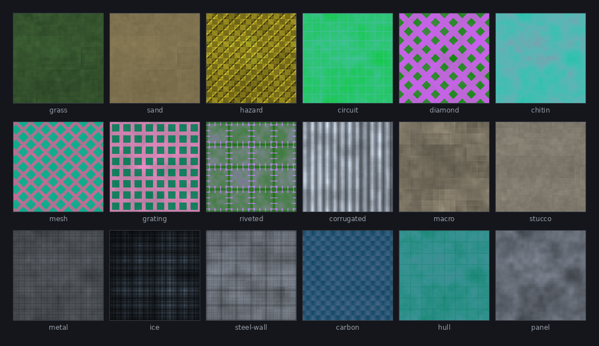
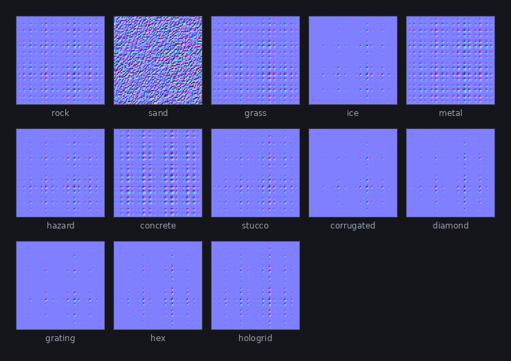
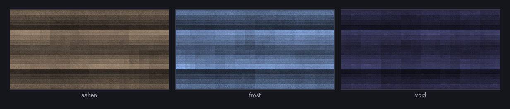
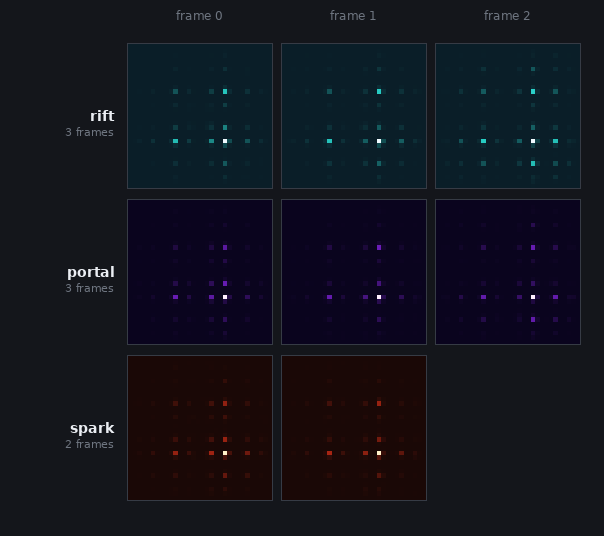
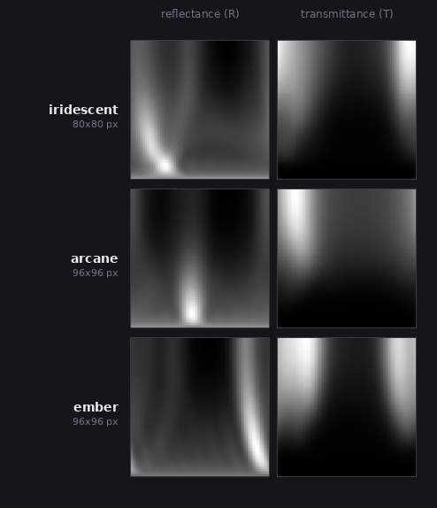
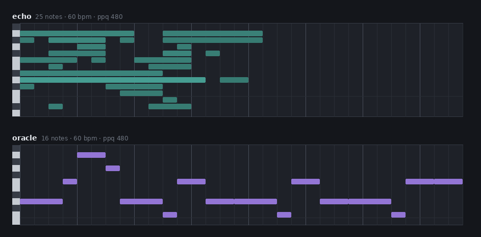
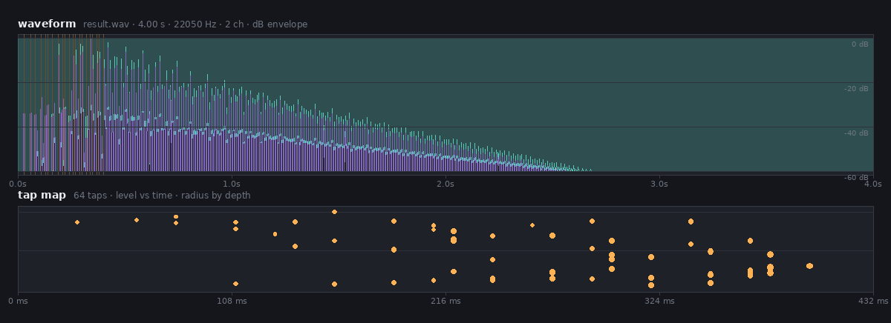

# mothbake

[](https://github.com/mojomast/mothbake/actions/workflows/ci.yml)

**Manifest-driven asset baking with zero runtime dependencies.**

`mothbake` runs a list of jobs against an asset-generation API, decodes every
result itself (PNG, GIF, ZIP, Radiance HDR, WAV, MIDI), reduces each result to a
small portable record, and emits whatever your project consumes: decoded files,
sprite-sheet atlases, one JSON bundle, a generated ES module, or a custom
emitter you write in a few lines.

It is built for pipelines where baked data must be deterministic, committed to
the repository, and readable at runtime without a browser decoder, a build step,
or an npm dependency tree — game textures, skyboxes, normal maps, animation
frames, sprite sheets, material LUTs, impulse responses, audio clips, motifs and
seeds.

## Gallery

<!-- GALLERY:START -->

The sheets below come from recorded bakes; no network or API key is involved.
They are regenerated with [`scripts/gallery.py`](scripts/gallery.py).

| Albedo tiles | Normal maps |
| --- | --- |
|  |  |
| Eighteen seamless `texture-tile` bakes, downscaled from 256 px. | Thirteen `normal-map` records derived from blurred height grids (strength 4 for legibility). |

| Skies | Effect frames |
| --- | --- |
|  |  |
| Three 512×256 equirectangular `sky` bakes: ashen, frost and void. | `effect-frame` records from radial, portal and spark grids through the `quantum`, `plasma` and `ember` ramps. |

| Material LUTs | Motifs |
| --- | --- |
|  |  |
| Reflectance (R) and transmittance (T) lobes from three `material-lut` packs, normalised per lobe for display. | Piano rolls from two `motif` bakes — `step` and `dur` are in sixteenth notes at 60 bpm. |

**Impulse response.** A 4-second `ir` bake: peak envelope in dB with tap times
marked, plus the tap map from the descriptor (level vs. time, radius by depth).



**In a real-time scene.** Baked albedos, normal maps and a baked sky, rendered
by a compatibility renderer.


<!-- GALLERY:END -->

## Features

- **Zero runtime dependencies.** Every decoder is in this repository — PNG
  (filters 0–4, colour types 0/2/3/4/6), GIF87a/89a (LZW, interlace,
  transparency, disposal, loops), ZIP (stored/deflate read *and* write),
  Radiance RGBE (flat and modern RLE), WAV (PCM 8/16/24/32-bit and 32-bit float
  decode + encode) and Standard MIDI (format 0/1). Auditable and installable in
  air-gapped CI.
- **Config is data or code.** A `mothbake.json` manifest, or a
  `mothbake.config.mjs` module when you want custom bakers, emitters or value
  generators.
- **Portable records.** A baker turns a finished job into a JSON-serializable
  `{ bucket, key, value }` fragment. Records diff, cache and ship well; emitters
  decide the final shape.
- **Offline-first.** Any job can carry a `recorded` block, so examples and tests
  run the *same* pipeline with no key and no network.
- **Failures are per job.** One bad job is reported and the rest still run; the
  command exits `1` at the end. Add `--strict` to stop at the first failure.
- **Provenance by default.** Bundles carry `engine`, `jobId`, `mode` and
  `credits` per job, and successful live submissions write their `jobId` back so
  the next run downloads instead of paying again.
- **Deterministic output.** Bucket order is first-seen and the ESM emitter is
  covered by a byte-for-byte golden test.

## Requirements

| | |
| --- | --- |
| Node.js | 20 or newer (ESM) |
| Dependencies | none, at runtime or install time |
| API key | `MOTH_API_KEY`, only for `catalog` and for `run` when a selected job is not recorded |

## Install

```bash
git clone https://github.com/mojomast/mothbake.git
cd mothbake
node bin/mothbake.mjs --help
```

That is the whole install — there is nothing to build and nothing to fetch.

Optionally put the command on your `PATH`:

```bash
npm link          # then: mothbake --help
```

## Quick start

```bash
# 1. Describe what to bake.
cat > mothbake.json <<'JSON'
{
  "jobs": [
    {
      "id": "rock-tile",
      "engine": "blur-v1",
      "inputs": { "image": "sources/rock.png" },
      "params": { "strength": 0.32, "style": "ry", "size": 256 },
      "raw": "rock-tile",
      "bake": { "type": "texture-tile", "name": "rock", "size": 64 }
    }
  ],
  "emitter": { "type": "esm", "file": "baked.mjs", "export": "BAKED" }
}
JSON

# 2. Check the manifest, then see what a run would do.
node bin/mothbake.mjs validate
node bin/mothbake.mjs run --dry

# 3. Render local source art (free, offline), then bake for real.
node bin/mothbake.mjs sources
MOTH_API_KEY=... node bin/mothbake.mjs run
```

Every artifact is written under `mothbake-out/` (change it with `--out`):
decoded files per bucket, `raw/` archives of the engine results, `index.json`,
and the `baked.mjs` module the config asked for.

A complete offline example — texture, sky, normal map, nine effect frames
(radial, portal, spark, bloom, vortex, contract, rise, shield and snow
generators), LUT, motif, two impulse responses (including an open-air room), an
animated GIF sprite sheet and a trimmed audio clip — lives in
[`examples/manifest.json`](examples/manifest.json):

```bash
node bin/mothbake.mjs run --config examples/manifest.json --out out/examples
```

## CLI reference

```
mothbake <command> [options]

Commands:
  catalog     List the engines the API exposes and their credit cost
  validate    Validate the config and report every problem
  sources     Generate procedural source art (PNG/MIDI) locally
  run         Resolve jobs, bake records, and run the emitters

Options:
  -c, --config <file>  Config file (default: mothbake.config.mjs / .js / mothbake.json)
  -o, --out <dir>      Output directory (default: mothbake-out; sources default: sources)
      --only <id>      Only this job (repeatable or comma-separated); with sources: pattern names
      --force          Ignore recorded fixtures and cached job ids; submit fresh jobs
      --dry            Print what would run without touching the API or writing files
      --strict         Stop at the first failed job instead of continuing
      --base <url>     Override the API base URL
  -h, --help           Show help
  -v, --version        Show the version
```

`run` exits non-zero if any job fails. `validate` exits non-zero if the config
has errors (warnings are printed but do not fail the run).

### Environment

| Variable | Meaning |
| --- | --- |
| `MOTH_API_KEY` | Bearer token. Required for `catalog`, and for `run` when any selected job is not recorded. Never written to disk. |
| `MOTH_API_BASE` | API base URL. Default `https://api.mothquantum.com`. Overridden by `--base` and overrides `baseUrl` from the config. |

### What a run does

1. **Plan** — load and validate the config, select jobs (`--only`, `enabled`).
2. **Resolve** — use a `recorded` fixture, reuse a cached `jobId`, or submit a
   live job (uploading inputs, injecting generated values, polling to
   completion).
3. **Archive** — save raw outputs under `<out>/raw/<raw>/`, plus `result.json`
   for inline JSON results.
4. **Bake** — run the job's baker over the raw outputs and inline result to
   produce a portable record.
5. **Emit** — hand all records to the configured emitters.

A failed job is reported and the remaining jobs still run; the command exits 1
at the end. Pass `--strict` (or `strict: true` to `runConfig`) to stop at the
first failure instead. Successful live submissions record their `jobId` back
into a JSON config, so re-running downloads the existing result instead of
paying for another run. Add `--force` to submit fresh jobs anyway.

## Configuration

A config is a JSON file or an ES module. Default filenames, in priority order:
`mothbake.config.mjs`, `mothbake.config.js`, `mothbake.json` (override with
`--config`).

```jsonc
{
  "version": 1,                     // optional; stamped into bundles
  "generator": "mothbake",          // optional; stamped into bundles
  "baseUrl": "https://api.mothquantum.com", // optional; env/flags win
  "jobs": [ /* required */ ],
  "sources": { /* optional; for `mothbake sources` */ },
  "emitter": { "type": "files" },   // optional; default { type: "files" }
  "emitters": [ /* optional; use instead of emitter for several */ ],
  "writeBack": true                 // optional; record jobIds into JSON configs
}
```

Relative paths in `inputs` and `recorded` are resolved against the config file's
directory. `sources.dir` is too; `--out` is resolved against the working
directory.

### Jobs

```jsonc
{
  "id": "rock-tile",              // required, unique
  "engine": "blur-v1",            // required; the API engine id
  "enabled": true,                // optional; false skips the job
  "jobId": "…",                   // optional; cached result, reused if completed
  "credits": 1,                   // optional metadata for provenance
  "inputs": { "image": "sources/rock.png" }, // optional; slot -> local file
  "params": { "strength": 0.32 }, // optional; passed to the engine
  "generateValues": { "type": "height", "size": 64, "seed": 11 }, // optional
  "raw": "rock-tile",             // optional; raw output dir name (default id)
  "bake": {                       // optional; omit to only archive the raw output
    "type": "texture-tile",       // required baker type
    "name": "rock",               // record key (default: the job id)
    "bucket": "textures",         // record bucket (default: the baker's default)
    "size": 64                    // baker-specific options
  },
  "recorded": {                   // optional; run fully offline from files
    "outputs": { "result": "../fixtures/tile.png" },
    "result": "../fixtures/grid.json"   // or an inline JSON value
  }
}
```

`input` is accepted as an alias of `inputs` (with a warning if both appear).

### Recorded results

A `recorded` block replaces the API round trip: `outputs` maps output slots to
local files, and `result` is the inline JSON result (a file path or an inline
value). This is how the test suite and the examples run without a key, and how
you can commit known-good results and re-bake them deterministically.

### Sources and value generators

`sources` configures the procedural source-art generator used by
`mothbake sources` (see [examples/sources.mjs](examples/sources.mjs)):

```jsonc
{
  "sources": {
    "dir": "sources",             // output dir, relative to the config
    "patterns": {                 // pattern name -> spec (merged over built-ins)
      "rock": { "size": 256, "palette": [0.5, 0.46, 0.4], "pattern": "noise", "contrast": 0.7 },
      "nebula": { "size": 256, "wide": 2, "pattern": "stars", "starDensity": 0.997 }
    },
    "only": ["rock"],             // optional restriction
    "motif": { "ppq": 480, "bpm": 60 } // optional; false disables the MIDI file
  }
}
```

Patterns: `noise` (seamless natural material), `panels`, `rivets`, `circuit`,
`stripes`, `corrugated`, `grating`, `diamond`, `weave`, `mesh`, `stars`.
Shared knobs: `size`, `wide`, `palette`, `contrast`, `freq`, `seed`, plus the
pattern-specific `panels`, `ribs`, `cells`, `cloudFreq`, `starDensity`.

`generateValues` synthesizes the grid some engines consume without shipping one
in the config. Built-ins:

| `generateValues.type` | Produces | Options |
| --- | --- | --- |
| `height` | seamlessly tiling height field | `size`, `seed`, `kind` (`noise` \| `ridge` \| `cells`) |
| `radial` | expanding shock ring | `size`, `seed`, `frame` |
| `portal` | ring with spokes and a hot core | `size`, `seed`, `frame` |
| `spark` | bright core with needle rays | `size`, `seed`, `frame` |
| `bloom` | explosion core inside an expanding shock ring | `size`, `seed`, `frame` |
| `vortex` | swirling ring of arms around a bright core | `size`, `seed`, `frame` |
| `contract` | contracting capture ring with radial ticks | `size`, `seed`, `frame` |
| `rise` | motes rising through a soft heal column | `size`, `seed`, `frame` |
| `shield` | expanding hexagonal bubble shell with seams | `size`, `seed`, `frame` |
| `snow` | drifting flakes, seamless across frames | `size`, `seed`, `frame` |

Every generator is pure and deterministic, returns a square `size`×`size` grid
of values in `[0, 1]`, and for the animated families accepts a `frame` index.
`height` also accepts `kind` (`noise` | `ridge` | `cells`); the effect families
use a fixed per-type `seed` default when one is not given.

Only `sources` writes files for patterns the jobs actually reference; the
filter is the set of `inputs` basenames across all jobs (plus `motif.mid`).

## Decoders

Every decoder is dependency-free and importable from `mothbake/decoders` or the
`mothbake/decoders/<name>` subpath (for example `mothbake/decoders/gif`).

| Format | Direction | Notes |
| --- | --- | --- |
| PNG (8-bit, non-interlaced) | decode + encode | Filters 0–4; colour types 0/2/3/4/6. Encoding is RGB or RGBA. |
| GIF87a/89a | decode | Global and local colour tables, LZW, interlacing, transparency, disposal methods 0–3 and the NETSCAPE loop count. Frames are composited onto a transparent logical-screen canvas, so every frame is full-size RGBA. |
| ZIP | read + write | Stored and deflate. `zip()` writes a deterministic classic archive (fixed DOS timestamp); ZIP64 is rejected with a clear error. |
| Radiance RGBE `.hdr` | decode | Flat and modern RLE. |
| WAV | inspect + decode + encode | 8/16/24/32-bit PCM and 32-bit float, up to 8 channels (more is a clear error, mixdown available). A-law, µ-law, ADPCM, 64-bit float and odd bit depths are rejected. |
| Standard MIDI | read + write | Format 0/1, running status, track chunks, SMPTE guard. |

`decodeWav(buffer, { mixdown })` returns normalized `channelData` (`Float32Array`
per channel) plus `samples` when `mixdown: true`; `encodeWav()` writes canonical
little-endian WAV back. `decodeGif(buffer)` returns `{ width, height, version,
background, loops, frames }` with `delay` in seconds. `unzip()`/`zip()` read and
write archives for engine input bundles.

## Bakers

A baker is a pure function that turns a finished job into a **portable record**
— a JSON-serializable `{ bucket, key, value }` fragment. `ctx` gives it the
decoded output slots, the inline result, the job, and the bake options.

| `bake.type` | Reads | `value` payload | Options |
| --- | --- | --- | --- |
| `texture-tile` | PNG | `{ width, height, format: 'rgba8', data }` (base64) | `slot`, `name`, `bucket`, `size` |
| `sky` | PNG | same, plus `equirect: true` | `slot`, `name`, `bucket`, `width`, `height` |
| `material-lut` | ZIP | `{ size, format: 'rgb8', r, t }` (base64) | `slot`, `name`, `bucket`, `size`, `reflectance`, `transmittance` |
| `normal-map` | grid result | RGBA tangent-space normals (base64) | `name`, `bucket`, `size`, `strength` |
| `effect-frame` | grid result | one RGBA frame; same `bucket`+`key` merges into `{ fps, frames }` | `name`, `effect`, `bucket`, `size`, `index`, `fps`, `tint`, `ramp`, `ramps` |
| `level-graph` | inline JSON | `{ name, rows, cols, numQubits, coupling, cells, measurements, metrics }` | `name`, `bucket`, `maxMeasurements` |
| `motif` | MIDI | `{ bpm, ppq, notes: [{ step, midi, dur, vel }] }` (steps in sixteenths) | `slot`, `name`, `bucket`, `maxNotes`, `transpose` |
| `ir` (alias `ir-descriptor`) | WAV (+ taps JSON) | `{ file, url, seconds, sampleRate, channels, format, taps }` | `slot`, `tapsSlot`, `name`, `bucket`, `maxTaps`, `url`, `urlBase` |
| `seed` | inline JSON | `{ seed, hex, bytes, bell, commitment, certificate, … }` | `name`, `bucket`, `hexChars` |
| `sprite-sheet` | GIF | `{ sheet: { width, height, format: 'rgba8', data }, frames: [{ index, x, y, w, h, delay, delayCs, duplicate }], loops, fps?, source }` | `slot`, `name`, `bucket`, `maxWidth`, `powerOfTwo`, `dedupe` |
| `audio-clip` | WAV | `{ container: 'wav', format, sampleFormat, sampleRate, channels, frames, seconds, data, loopStart, loopEnd, gain, peak, trimStart, trimEnd, source }` | `slot`, `name`, `bucket`, `trim`, `threshold`, `pad`, `trimStart`, `trimEnd`, `normalize`, `peak`, `sampleFormat`, `loopStart`, `loopEnd`, `mixdown`, `maxChannels` |

Notes:

- Image records carry base64 bytes plus `format` (`rgba8` and `rgb8` are the
  current formats), so emitters and consumers never have to guess.
- `effect-frame` records with the same `bucket` and `key` merge by `index`; the
  last `fps` wins and gaps are removed. The key falls back to `bake.effect` when
  `bake.name` is absent, so an effect can be named independently of the record.
- `ir.file` is relative to the output dir. `url` is only populated when the bake
  config sets `url` (with `{raw}`, `{slot}`, `{file}` placeholders) or `urlBase`
  (e.g. `"/audio/ir"` → `/audio/ir/<raw>/result.wav`).
- Grid-based bakers accept the inline result, a `{ result: … }` response, or a
  `{ output: … }` value, so the same config works for live and recorded runs.
- `sprite-sheet` packs the composited GIF frames left-to-right, wrapping to a
  new row at `maxWidth` (default 2048). The sheet is trimmed to the used area
  unless `powerOfTwo` pads both axes. Consecutive identical frames are not given
  a new rectangle: with `dedupe` (default true) the duplicate keeps its own
  `delay` and reuses the previous rectangle, so playback timing is unchanged;
  set `dedupe: false` to give every frame its own rectangle.
- `audio-clip` trims leading/trailing silence below `threshold` (default 0.001)
  and restores `pad` seconds (default 0) on each side; `trimStart`/`trimEnd`
  (seconds) override auto-detection and `trim: false` disables it. The clip is
  peak-normalised to `peak` (default 1) unless `normalize: false`, and the
  applied `gain` plus the pre-normalisation `peak` are recorded. `loopStart` and
  `loopEnd` are seconds measured from the start of the trimmed clip.

## Emitters

An emitter is `emit(records, ctx) => filesWritten`:

```js
/**
 * @param {Array<{ job, type, bucket, key, value, merge?, index?, fps? }>} records
 * @param {{
 *   outDir: string,
 *   config: object,
 *   options: object,        // the emitter entry minus `type`
 *   provenance: object,     // job id -> { engine, jobId, mode, name, credits }
 *   version: number,
 *   generator: string,
 *   log: (message: string) => void,
 * }} ctx
 * @returns {string[]} paths written
 */
```

Built-ins:

| `type` | Writes | Options |
| --- | --- | --- |
| `files` | one file per record, decoded: `<bucket>/<key>.png` for image and sprite-sheet records, `.r.png`/`.t.png` for LUTs, numbered frames for effects, `<bucket>/<key>.wav` for audio clips, `.json` for structured records, IR audio copied next to its descriptor, plus `index.json` | `dir`, `index`, `indexFile` |
| `json` | one aggregate bundle: `{ version, generator, provenance, <buckets…> }` | `file`, `pretty`, `provenance`, `shape` (`buckets` \| `records`) |
| `esm` | a generated module: `export const <name> = …; export default <name>;` | `file`, `export`, `defaultExport`, `header`, `provenance`, `shape` |
| `atlas` | `<bucket>/<key>.png` for each sprite-sheet record plus a `<bucket>/<key>.json` sidecar with the animation metadata; deterministic and idempotent | `dir`, `sidecar`, `pretty` |

```jsonc
{
  "emitter": { "type": "esm", "file": "baked.mjs", "export": "BAKED" }
}
```

or several at once:

```jsonc
{
  "emitters": [
    { "type": "files" },
    { "type": "json", "file": "bundle.json" },
    { "type": "esm", "export": "ASSETS", "provenance": false }
  ]
}
```

### Animated images and audio

```jsonc
{
  "jobs": [
    {
      "id": "walk-sheet",
      "engine": "qrc-image-v1",
      "bake": { "type": "sprite-sheet", "name": "walk", "maxWidth": 256, "powerOfTwo": true },
      "recorded": { "outputs": { "result": "../test/fixtures/anim.gif" } }
    },
    {
      "id": "sfx-clip",
      "engine": "qrc-audio-v1",
      "bake": {
        "type": "audio-clip",
        "name": "footstep",
        "threshold": 0.001,
        "sampleFormat": "pcm16",
        "loopStart": 0,
        "loopEnd": 0.02
      },
      "recorded": { "outputs": { "result": "../test/fixtures/clip-padded.wav" } }
    }
  ],
  "emitters": [{ "type": "atlas" }, { "type": "files" }]
}
```

The `atlas` emitter writes `sprites/walk.png` plus `sprites/walk.json`
(`{ width, height, sheet, frames, loops, fps }`); `files` writes
`audio/footstep.wav` from the normalised clip.

## Extend it

The pipeline is four contracts — **jobs**, **results**, **records**, **emitters**
— and every step between them is a pure function, so the whole thing tests
offline. There are three usual extension points:

- **A custom baker** turns any result into a record of your own shape:
  `bakers: { 'my-baker': (job, ctx) => ({ bucket, key, value }) }`.
- **A custom emitter** writes anything you can write from a file:
  `emitters: [fn]` or `{ name, options, emit }`; return the paths you wrote.
- **A custom value generator** feeds engines that expect a grid:
  `generators: { myGrid: (spec) => grid }`.

```js
// mothbake.config.mjs
import fs from 'node:fs';
import path from 'node:path';

export default {
  bakers: {
    'my-baker': (job, ctx) => ({
      bucket: 'custom',
      key: job.bake.name ?? job.id,
      value: { bytes: ctx.files.get('result')?.length ?? 0 },
    }),
  },
  jobs: [{ id: 'x', engine: 'blur-v1', bake: { type: 'my-baker' } }],
  emitters: [
    { type: 'files' },
    (records, { outDir }) => {
      const target = path.join(outDir, 'counts.txt');
      fs.writeFileSync(target, records.map((record) => record.key).join('\n'));
      return [target];
    },
  ],
};
```

The ESM emitter is the usual way to ship a game's baked data: a bucket-shaped
aggregate with a provenance table is one valid config, and a flat record list
(`shape: "records"`) is another.

[docs/ARCHITECTURE.md](docs/ARCHITECTURE.md) documents the pipeline stages,
the module map, the decoder coverage and the design decisions behind them.
[docs/SYNC.md](docs/SYNC.md) records what this tool shares with its upstream
pipeline and the rule for keeping the two in step.

## Examples

[`examples/manifest.json`](examples/manifest.json) is a runnable config with
texture, sky, normal map, nine effect frames (one per generator), LUT, motif,
two impulse-response jobs, sprite-sheet and audio-clip jobs. Every job is
recorded, so it works offline with no key:

```bash
node bin/mothbake.mjs validate --config examples/manifest.json
node bin/mothbake.mjs run --config examples/manifest.json --out out/examples
node bin/mothbake.mjs sources --config examples/manifest.json
```

The recorded fixtures live in [`test/fixtures/`](test/fixtures) (small, trimmed
engine results kept for tests and examples). [`examples/sources.mjs`](examples/sources.mjs)
shows the source-art generator directly.

## Security

`MOTH_API_KEY` is read from the environment only. It is never written to the
config, the raw archive, emitted bundles, or logs. Keep it in your shell or a
gitignored `.env` file; [`.env.example`](.env.example) documents both variables.

## Development

```bash
npm test          # offline: decoders, bakers, config, CLI, a mock API cycle
npm run test:watch
```

The test suite makes no external network calls. The one HTTP test runs against a
local mock that serves the recorded fixtures; everything else is pure functions
and spawned CLI processes.

The README gallery is generated from recorded bakes with Python (Pillow +
numpy); see `python3 scripts/gallery.py --help` for the inputs it expects.

The animated-GIF and WAV fixtures used by the media tests were generated once
with the system `ffmpeg` and committed, so the suite stays offline; regenerate
them with `scripts/make-fixtures.sh` if `ffmpeg` is available.

## License

MIT © mojomast — see [LICENSE](LICENSE). Use it, fork it, ship baked assets with
it.

**Generated-output rights.** mothbake itself is MIT, but the assets it bakes are
yours to account for: output rights are the user's responsibility and remain
subject to the terms of whichever upstream service produced them and to the
rights of any source material you supplied.
